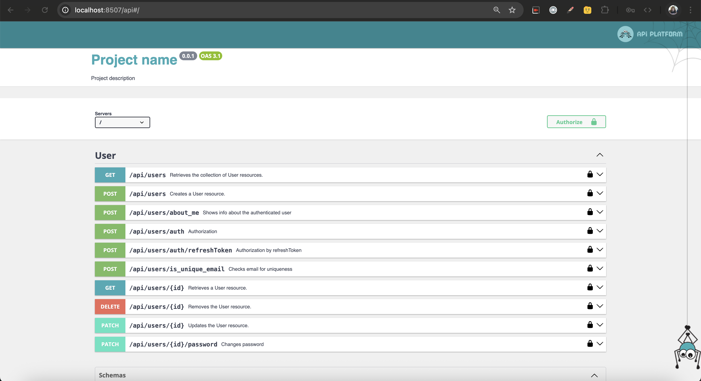

# Api Starter Kit

[//]: <> ( todo udpate image and add new docker commands, tell about interfaces )


Starter kit for API with 
[Symfony Skeleton](https://symfony.com/),
[Doctrine](https://www.doctrine-project.org/), 
[Maker Bundle](https://symfony.com/doc/current/bundles/SymfonyMakerBundle/index.html), 
[Migrations Bundle](https://symfony.com/doc/current/bundles/DoctrineMigrationsBundle/index.html), 
[Api-Platform](https://api-platform.com/) and 
[Lexik JWT-auth](https://jwt.io/).

Kit has also already created User entity with all crud routes

Kit has 3 docker containers: **php, nginx** and **mysql** 


## Installation

Download the project<br>
```composer create-project kadirov/api-starter-kit --ignore-platform-reqs --no-scripts```

Go to the project directory<br>
```cd api-starter-kit```

Run docker containers <br>
```docker compose up -d```

Install composer scripts:<br>
```docker compose exec php composer install```

To install project run command:<br>
```docker compose exec php bin/console ask:install```

**Done! You can open <a href="http://localhost:8507/api" target="_blank">http://localhost:8507/api</a> via browser. 
By the way, you can change this port by changing ```DOCKER_NGINX_PORT``` variable in [.env](.env) file.** 

## Docker
For enter to php container run 
```docker compose exec php bash```

For enter to mysql container run 
```docker compose exec mysql bash```

For enter to nginx container run 
```docker compose exec nginx bash```

You can change containers prefix by changing ```DOCKER_PROJECT_NAME``` variable in [.env](.env) file.  

Also, you can change public ports of nginx and mysql by changing ```DOCKER_NGINX_PORT``` and ```DOCKER_DATABASE_PORT```

Database allows connections only from localhost. 
Because of this when you use the project on production and want to connect to database from your computer
you should connect via ssh bridge.

## Backup
For auto backup you can use ```docker compose --profile backup up -d``` 

## Cron

You can use [docker/php/cron-file](docker/php/cron-file) for cron jobs. 
After you must re-build php container by running command:<br> 
```docker compose up -d --build```

## Swagger 
You can change project name and description on swagger by editing file
[config/packages/api_platform.yaml](config/packages/api_platform.yaml)
